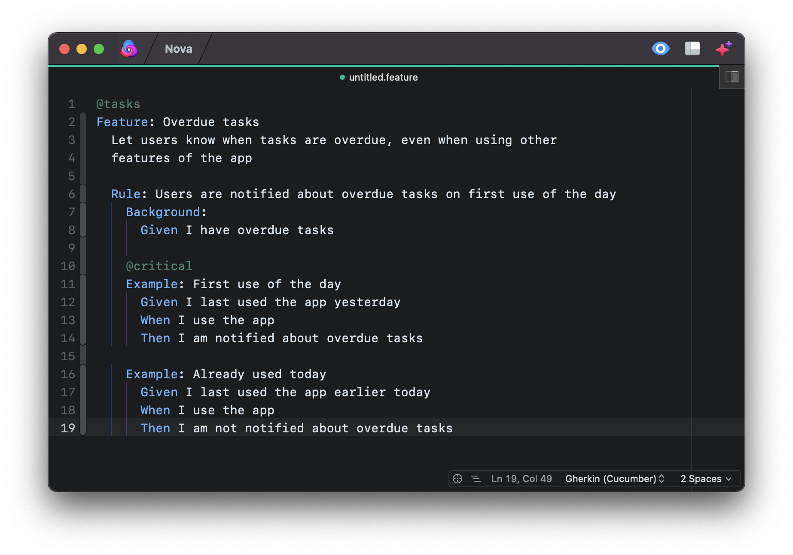

<!--
👋 Hello! As Nova users browse the extensions library, a good README can help them understand what your extension does, how it works, and what setup or configuration it may require.

Not every extension will need every item described below. Use your best judgement when deciding which parts to keep to provide the best experience for your new users.

💡 Quick Tip! As you edit this README template, you can preview your changes by selecting **Extensions → Activate Project as Extension**, opening the Extension Library, and selecting "Cucumber" in the sidebar.

Let's get started!
-->

<!--
🎈 Include a brief description of the features your syntax extension provides. For example:
-->

The **Cucumber** Nova extension provides syntax highlighting and autocompletion for **Gherkin**, the language used to write Cucumber examples.

<!--
🎈 It can also be helpful to include a screenshot or GIF showing your extension in action:
-->

<!-- ## Language Support -->

<!--
🎈 Whether your extension covers the entirety of a language's syntax or a subset, it can be helpful to describe that for users:
-->

Cucumber currently supports the following features of Gherkin:

- Features, Rules, Backgrounds, Examples, and Steps
- Tags
- String and number arguments in step definitions
- Docstrings with embedded syntax

Support for:

- Markdown highlighting for feature descriptions
- Example Groups

is planned for a future update.

<!--
👋 That's it! Happy developing!

P.S. If you'd like, you can remove these comments before submitting your extension 😉
-->
